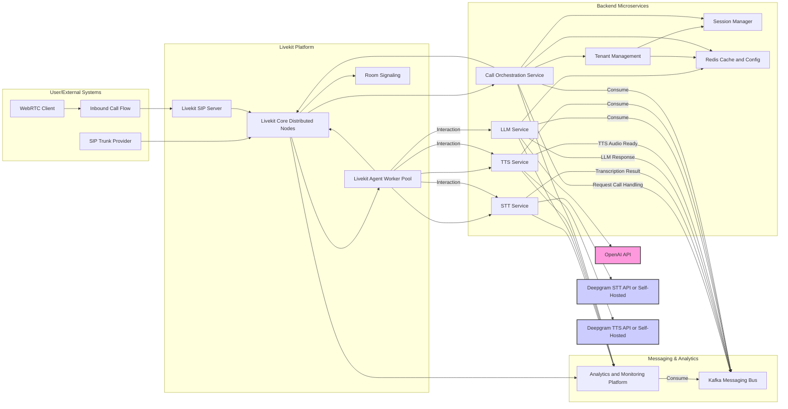

# **Architecting a High-Concurrency, Multi-Tenant Voice AI Backend for SaaS**

## **1\. Executive Summary**

**Purpose:** This report outlines a strategic architectural approach for developing a scalable, high-concurrency, multi-tenant backend system for a voice AI agent platform. The platform aims to serve multiple businesses and their users via a Software as a Service (SaaS) and whitelabel model, handling both inbound and outbound Session Initiation Protocol (SIP) calls. The core technology stack involves Livekit for real-time communication and SIP integration, Deepgram for Speech-to-Text (STT), OpenAI for Large Language Model (LLM) processing, and a Text-to-Speech (TTS) solution, with a specific focus on evaluating Deepgram Aura-2 as a cost-effective, high-performance alternative to ElevenLabs.

**Proposed Solution Overview:** The recommended architecture employs a microservices approach, leveraging asynchronous communication via an event-driven pattern, likely using Apache Kafka. This design promotes scalability, resilience, and maintainability. Key technology recommendations include self-hosting Livekit for maximum control and potential cost savings at scale, utilizing Deepgram Nova-3 for STT (preferably self-hosted for data privacy and performance), adopting Deepgram Aura-2 for TTS (balancing cost, performance, and enterprise features, potentially self-hosted), and integrating OpenAI's LLM via its API with streaming enabled. Robust multi-tenancy mechanisms and integrated analytics are central to the design.

**Key Benefits:** The proposed architecture is designed to deliver:

* **High Scalability:** Capable of handling a large volume of concurrent calls across numerous tenants and users by independently scaling individual microservices and leveraging distributed technologies like Livekit and Kafka.  
* **Low Latency:** Optimized for natural, real-time conversations by selecting low-latency components (Deepgram STT/TTS), enabling LLM response streaming, and minimizing network overhead where possible (e.g., self-hosting).  
* **Cost-Effectiveness:** Achieved through careful component selection (particularly recommending Deepgram Aura-2 over more expensive TTS options), optimizing API usage, and providing a framework for analyzing cloud vs. self-hosting trade-offs.  
* **Robust Multi-Tenancy:** Ensures secure data, configuration, and performance isolation between different business clients using appropriate database strategies and tenant context propagation.  
* **Integrated Analytics:** Provides the foundation for comprehensive monitoring of performance, cost, AI quality, and user experience, enabling continuous system refinement.

**Call to Action:** This report provides a detailed architectural blueprint and implementation roadmap to guide the development of this sophisticated voice AI platform.

**Table 1: High-Level Component Recommendation Summary**

| Component | Recommendation | Key Justification |
| :---- | :---- | :---- |
| Media Server | Livekit (Self-Hosted, Distributed) | Open-source, scalable SFU, supports WebRTC & SIP, controllable deployment 1 |
| SIP Integration | Livekit SIP Module (Self-Hosted) | Native Livekit integration, standard SIP compatibility 3 |
| STT | Deepgram Nova-3 (Self-Hosted Recommended) | High accuracy, real-time, enterprise focus, data privacy via self-hosting 4 |
| LLM | OpenAI API (GPT-4 / Latest, with Streaming) | State-of-the-art capabilities, streaming reduces perceived latency 6 |
| TTS | Deepgram Aura-2 (API or Self-Hosted) | Low latency (sub-200ms TTFB), cost-effective, enterprise-grade, self-hosting option 8 |
| Deployment Strategy | Microservices, Event-Driven (Kafka), Kubernetes | Scalability, resilience, maintainability, decoupling 9 |
| Analytics | Integrated Monitoring (e.g., Prometheus, Grafana) | Performance/cost optimization, quality assessment, troubleshooting 9 |

## **2\. Scalable Voice AI Backend Architecture**

**2.1 Architectural Goals Revisited**

The primary objective is to design a backend system capable of supporting a high volume of concurrent voice AI interactions for a multi-tenant SaaS platform. This entails several critical goals: achieving high concurrency across numerous businesses and their users; ensuring low end-to-end latency in the STT \-\> LLM \-\> TTS pipeline for natural conversations; designing for horizontal scalability to accommodate growth; optimizing for cost-effectiveness, particularly in API usage and infrastructure; implementing robust multi-tenancy with strong isolation; integrating seamlessly with both WebRTC and SIP via Livekit; ensuring maintainability and security; and incorporating comprehensive analytics.

**2.2 Proposed Architecture: Microservices & Event-Driven Approach**

To meet these demanding requirements, a **microservices architecture** is strongly recommended over a traditional monolithic approach. The inherent nature of the voice AI pipeline, involving distinct processing stages (STT, LLM, TTS) and real-time communication management (Livekit), lends itself well to decomposition into independent services.9 This offers significant advantages:

* **Independent Scalability:** Each component (Livekit instances, STT workers, TTS workers, LLM interaction service, tenant management) can be scaled horizontally based on its specific load, optimizing resource utilization.9 For example, if STT processing becomes a bottleneck due to high call volume, only the STT service needs scaling, not the entire application.  
* **Technology Diversity:** Different services can potentially use the most suitable technology stack for their specific task.  
* **Improved Maintainability:** Smaller, focused services are easier to develop, test, deploy, and update independently.13  
* **Fault Isolation:** A failure in one microservice (e.g., a temporary issue with the TTS provider API) is less likely to bring down the entire system, enhancing overall resilience.13 This is particularly crucial in real-time voice systems where service disruptions directly impact user experience.7 A failure in the TTS service, for instance, should not halt STT processing or the ability to handle incoming calls, even if the final audio output for some calls is affected.

Complementing the microservices structure, an **event-driven communication pattern** using a message broker like **Apache Kafka** is proposed.10 Instead of direct, synchronous requests between services (e.g., STT service calling the LLM service via REST), services communicate asynchronously by publishing events to Kafka topics and subscribing to relevant topics.10 For example:

1. The STT service processes an audio chunk and publishes a TranscriptionResult event (containing text, call ID, tenant ID, timestamp) to a stt-results Kafka topic.  
2. The LLM service subscribes to stt-results, consumes the event, processes the text using the OpenAI API, and publishes an LLMResponse event to an llm-results topic.  
3. The TTS service subscribes to llm-results, consumes the event, generates audio using the Deepgram Aura-2 API, and potentially publishes an event indicating audio availability or streams it back via Livekit.

This event-driven approach provides:

* **Decoupling:** Services don't need direct knowledge of each other, reducing dependencies.10  
* **Resilience:** If a consuming service (e.g., LLM service) is temporarily unavailable, messages remain in Kafka and can be processed later, preventing data loss.15 Kafka acts as a durable buffer.10  
* **Scalability & Backpressure Handling:** Kafka naturally handles scenarios where producers generate messages faster than consumers can process them, preventing overload.10 Consumer groups can be scaled independently by adding more instances of the consuming microservice.17  
* **Flexibility:** New services can easily subscribe to existing topics (e.g., an analytics service consuming stt-results and llm-results) without requiring modifications to the original producer services.10 This supports evolutionary architecture, vital for a growing SaaS platform.

While Kafka handles the core asynchronous flow, **Redis** can be employed for specific caching and state management needs.18 Uses include:

* **Caching:** Storing frequently accessed, relatively static data like tenant configurations or potentially common LLM responses.  
* **Distributed Session/Context Management:** Holding short-term conversational state keyed by session/call ID, reducing the need to pass large context payloads through Kafka (discussed further in Section 2.4).19

**2.3 Core Architectural Flow Diagram**

*Diagram Description:* SIP and WebRTC clients connect via the SIP Trunking Provider and directly to the distributed Livekit Core, respectively. The Livekit SIP Server handles SIP signaling. Livekit Core, coordinated by Redis, manages rooms and participants, distributing load across nodes and interacting with a pool of Livekit Agents/Workers. These agents orchestrate the AI pipeline, interacting with dedicated microservices for STT, LLM, and TTS. Communication between backend microservices (including Call Orchestration and Tenant Management) primarily occurs asynchronously via Apache Kafka topics. Services publish events (e.g., transcription results, LLM responses), and other services subscribe to consume these events. Redis serves as a cache for configuration/state and potentially short-term conversation context. A central Database stores persistent multi-tenant data. An Analytics Platform consumes events from Kafka and logs from services for monitoring and analysis. External API calls are made to OpenAI and potentially Deepgram (if not self-hosted).

**2.4 State Management Strategy**

A significant challenge in this distributed, real-time architecture is managing the state of each ongoing conversation, particularly the context required by the LLM.7 Each call involves multiple turns, and the LLM needs the history of the conversation to generate coherent and relevant responses.23 Since microservices are typically stateless and requests for a single call might be handled by different service instances over time, a robust state management strategy is crucial.19

Potential strategies include:

1. **Passing State via Events:** Include the necessary conversational context (e.g., previous turns, summary) within the Kafka messages passed between services. While simple conceptually, this can lead to large message payloads, increasing network traffic and Kafka storage requirements, especially as conversation history grows.15  
2. **Distributed Cache (Redis):** Store the conversational context in a fast, distributed cache like Redis, keyed by a unique call/session identifier.19 Kafka messages would then only need to carry the session ID. Services needing context (primarily the LLM service) would fetch it directly from Redis. This keeps message payloads small but introduces Redis as a critical dependency and requires careful management of cache eviction and consistency. Given that LLM context can become large, but is frequently accessed during a call, this hybrid approach often strikes a good balance.  
3. **Livekit Metadata:** Potentially leverage Livekit's participant or room metadata features to store or propagate some state information, although this might be more suitable for simpler state elements rather than full conversational context.

The recommended approach is likely a **hybrid model**, primarily using a **distributed cache like Redis for storing the main conversational context** 19 and passing essential identifiers (call ID, tenant ID, user ID, turn number) via Kafka messages. This avoids bloating messages while providing efficient access to the state needed by the LLM service. Careful design of the data structure stored in Redis and the cache invalidation/TTL (Time-To-Live) strategy will be necessary. Relying solely on passing large state blobs via Kafka messages is likely to become inefficient and complex to manage at scale.

## **3\. Component Deep Dive & Recommendations**

**3.1 Real-time Communication (Livekit)**

Livekit forms the backbone of real-time audio and video communication, including the crucial SIP integration.

* **Distributed Deployment:** Livekit is architected for distributed deployments across multiple servers (nodes).2 When self-hosting, configuring Livekit to use Redis enables this distributed mode. Redis acts as a shared data store for room information and a message bus for inter-node communication.2 Each node reports its status and load to Redis, allowing for cluster awareness and intelligent routing.2 Livekit Agents, which handle the AI pipeline integration, are designed as stateless workers that connect to the Livekit server via WebSockets and do not require public internet exposure.24  
* **Scaling Strategy:** In a distributed setup, Livekit automatically routes new room creation requests to an available node based on load and, optionally, geographic region.2 This distributes the workload of hosting rooms across the cluster. Scaling up involves adding more Livekit server instances. Scaling down is handled gracefully through connection draining: when an instance receives a termination signal, it stops accepting new rooms but allows existing sessions to complete before shutting down, preventing abrupt disconnections.2 Livekit recommends starting capacity planning with 4 CPU cores and 8GB RAM per 25 concurrent voice agent sessions, but emphasizes that actual requirements depend heavily on the specific workload (e.g., use of noise cancellation).24 It's also crucial to configure a sufficiently long termination grace period (e.g., 10+ minutes) for agent workers to allow conversations to finish naturally during rollouts or scaling events.24  
* **SIP Integration:** Livekit provides a dedicated SIP service component that bridges traditional telephony (via a SIP trunking provider) and Livekit rooms.3 For self-hosted deployments, this SIP service must be deployed separately from the core Livekit server.3 Configuration involves setting up SIP Trunks (mapping to your provider) for inbound and/or outbound calls and defining Dispatch Rules that determine how incoming calls (potentially identified by number or PIN) are routed to specific Livekit rooms.3 Livekit SIP treats each call leg as a standard participant, allowing management via standard APIs and supporting features like DTMF, call transfer (REFER), custom SIP header mapping, and Krisp noise cancellation.3 Standard firewall rules apply, typically requiring ports 5060 (SIP UDP/TCP) and a range for RTP (e.g., 10000-20000 UDP) to be open and correctly routed.26 Livekit has verified compatibility with major SIP providers like Twilio, Telnyx, and Plivo.3  
* **Performance & Limitations:** Livekit's Selective Forwarding Unit (SFU) architecture is generally more efficient for multi-participant sessions than traditional P2P or MCU approaches, optimizing bandwidth usage.1 Benchmarks demonstrate capabilities for handling large numbers of participants (e.g., 3000+ in audio-only rooms, 150 in large video meetings) within a single room on adequate hardware (e.g., 16-core server).27 However, a key limitation mentioned for the self-hosted version is that a single room must currently reside on a single node, potentially limiting the scale of a single massive conference call, though this is less likely to be a constraint for typical voice agent scenarios involving fewer participants per room.2 Livekit Cloud offers architectural differences like a mesh SFU which may overcome this limitation and provides built-in analytics and uptime guarantees not present in the open-source version.28  
* **Configuration:** Key aspects for a distributed, SIP-enabled setup include configuring the Redis connection string, potentially setting region identifiers for multi-datacenter deployments 2, providing API keys for integrated services (Deepgram, OpenAI) as environment variables to the Agent workers 24, and ensuring appropriate terminationGracePeriodSeconds in Kubernetes or equivalent for agent pods.25

**3.2 Speech-to-Text (STT): Deepgram Nova-3**

Accurate and fast STT is critical for the voice agent's understanding.

* **Recommendation:** Deepgram Nova-3 is recommended as the STT engine. It demonstrates state-of-the-art accuracy, with significant reductions in Word Error Rate (WER) compared to competitors, particularly in real-time streaming scenarios and noisy environments.29 Its design explicitly targets enterprise use cases involving challenging audio conditions like background noise and overlapping speech.4 Nova-3 also supports real-time transcription of conversations involving code-switching between multiple languages (initially 10, including English, Spanish, French, German, Hindi, etc.), a valuable feature for diverse user bases.30  
* **Self-Hosting vs. Cloud API:**  
  * **Self-Hosting:** This option provides maximum data privacy and control, as sensitive voice data and transcriptions remain within the organization's infrastructure.8 It can also potentially offer lower latency by eliminating the internet round trip to Deepgram's cloud.8 Furthermore, self-hosting, tied to an Enterprise plan, typically allows for higher or customizable concurrency limits compared to standard cloud tiers.34 However, it comes with significant prerequisites: a Deepgram Enterprise Plan is required (typically starting at $15k+/year 36), specific NVIDIA GPU hardware (Compute Capability 7.0+, 16GB+ VRAM recommended, e.g., L4, T4, A10) must be provisioned on Linux servers (x86-64), and deployment necessitates container orchestration (Kubernetes recommended).5 Deepgram provides the necessary encrypted model files (e.g., .dg format for Nova-3) and configuration.5 Specific models like Nova-3 General and Nova-3 Medical are confirmed available for self-hosting.31 The operational overhead of managing GPU infrastructure and the Deepgram software stack must be factored in.  
  * **Cloud API:** Offers a much simpler setup with pay-as-you-go pricing (Nova-3 around $0.0043-$0.0058 per minute depending on tier/language 36) and managed infrastructure. The main drawbacks are that data is processed externally, latency includes network time, and concurrency is strictly limited by the chosen plan (e.g., Nova-3 streaming limited to 50 concurrent requests on Pay-as-you-go and Growth tiers 35).  
  * **Strategic Consideration:** The decision to self-host STT is a major one. While potentially offering latency and concurrency benefits, the primary driver in a B2B SaaS context is often data privacy and control demanded by enterprise clients handling sensitive information.8 The substantial cost of the Enterprise plan and GPU infrastructure means self-hosting is unlikely to be cheaper than the API at lower volumes. A thorough cost-benefit analysis based on projected call volume and tenant data sensitivity requirements is essential.  
* **Performance:** Nova-3 boasts significant WER reductions (e.g., 54.3% for streaming vs. competitors in initial benchmarks).29 It maintains low latency comparable to Nova-2.29 Features like Keyterm Prompting allow improving accuracy for up to 100 domain-specific terms (like product names or jargon) in real-time without needing model retraining, offering valuable customization for different business tenants.29  
* **Cost:** Cloud API pricing is per minute, tiered based on volume.36 Self-hosting involves the Enterprise plan fee, infrastructure costs (servers, GPUs, bandwidth, power/cooling), and operational personnel costs.

**3.3 Text-to-Speech (TTS): Comparative Analysis**

The TTS component significantly impacts perceived latency and the naturalness of the voice agent. The current use of ElevenLabs prompts a comparison with alternatives, especially Deepgram Aura-2, considering cost and performance.

* **Evaluation Criteria:** The primary factors for comparison are: Voice Quality & Naturalness (including suitability for professional interactions), Latency (specifically Time-To-First-Byte or TTFB, which dictates how quickly the agent starts speaking), Concurrency Limits (how many simultaneous requests can be handled), Cost Model (pricing structure and per-unit cost), Self-Hosting Availability (for data privacy/control), and Ease of Integration/Features.  
* **Deepgram Aura-2:**  
  * *Quality/Features:* Designed specifically for enterprise conversational AI, offering 40+ professional-sounding US English voices with various accents.8 It excels at domain-specific pronunciation (e.g., technical terms, numerals) without special markup and provides context-aware delivery (adjusting pace, tone).8 User preference tests showed it favored over competitors like ElevenLabs and OpenAI in enterprise scenarios.8  
  * *Latency:* A key differentiator is its consistently advertised **sub-200ms TTFB**, optimized for real-time responsiveness.8 This low TTFB is critical for minimizing pauses in conversation.  
  * *Concurrency:* Cloud API limits depend on the plan (Pay-as-you-go: 40 concurrent WebSocket connections; Growth: 80).35 Enterprise/Self-hosted options likely offer significantly higher or customizable limits (starting at 150 concurrent requests for Enterprise streaming).35  
  * *Cost:* Priced at **$0.030 per 1,000 characters** via the cloud API.8 This is substantially more cost-effective than ElevenLabs' typical rates.33 Volume discounts are available for enterprise tiers.  
  * *Self-Hosting:* Available via the Deepgram Enterprise Runtime (DER) for on-premises or VPC deployment, offering data control and potential further latency reduction by eliminating cloud round trips.8 Requires an Enterprise plan.  
* **ElevenLabs:**  
  * *Quality/Features:* Widely recognized for high voice quality and naturalness, offering a large voice library and advanced voice cloning capabilities.42 May have initially focused more on creative/media use cases compared to Aura-2's enterprise tuning.38  
  * *Latency:* Offers low-latency models like "Flash".42 However, specific TTFB benchmarks are less prominent in the provided documentation compared to Deepgram's sub-200ms claim. Some comparisons suggest Aura-2 may be faster.40 Their conversational AI product integrates STT/TTS to potentially reduce server calls.42  
  * *Concurrency:* API concurrency is tiered based on subscription plan, ranging from 4 (Free) to 30 (Scale/Business) concurrent requests for faster models.44 Enterprise plans offer higher limits.44  
  * *Cost:* Generally considered more expensive. Uses a credit system where costs can equate to roughly $0.06 \- $0.15+ per 1,000 characters depending on the plan and model used.43 Conversational AI is priced per minute (\~$0.08-$0.12/min depending on plan).43  
  * *Self-Hosting:* Not mentioned as a standard offering in the provided materials; primarily a cloud API service. Custom enterprise arrangements might be possible but are not standard.  
* **Google Cloud TTS:**  
  * *Quality/Features:* Offers a range of voices, including high-quality WaveNet and Neural2 options.47  
  * *Latency:* Generally low latency, with some sources mentioning \~200ms TTFB.48 Supports real-time streaming synthesis.49  
  * *Concurrency:* High request-per-minute limits (1000 RPM) 50, but specific limits on concurrent *streaming* connections are less clear than Deepgram/ElevenLabs.  
  * *Cost:* Very competitive, with Neural2/WaveNet voices at **$16 per 1 million characters** ($0.016 / 1k chars).47 This is cheaper than Aura-2's standard rate. Includes a free tier.  
  * *Self-Hosting:* Not available.  
* **Azure Speech Services:**  
  * *Quality/Features:* Provides high-quality neural voices and options for custom voice training.51  
  * *Latency:* Supports real-time synthesis and offers features for latency reduction, including text streaming.53 Specific TTFB figures are not highlighted but latency measurement tools are available.53  
  * *Concurrency:* Standard tier defaults to 200 transactions per second (TPS), which is adjustable.54 Free tier is very limited.  
  * *Cost:* Highly competitive, with standard Neural voices at **$15 per 1 million characters** ($0.015 / 1k chars).51 Commitment tiers offer further discounts. Includes a free tier.  
  * *Self-Hosting:* Available via disconnected or connected containers, typically requiring commitment tiers.55  
* **Piper/Coqui XTTS (Open Source):**  
  * *Quality/Features:* Piper is known for speed and efficiency, running well even on low-power hardware like Raspberry Pi, with decent quality.57 Coqui XTTS offers higher quality, voice cloning, and multilingual support.60  
  * *Latency:* Piper is extremely fast, achieving real-time factors less than 1\.57 Coqui XTTS claims sub-200ms latency for streaming.62  
  * *Concurrency:* Entirely dependent on the deployed hardware resources. Can be scaled horizontally.  
  * *Cost:* Software is free, but requires investment in infrastructure (potentially including GPUs for Coqui XTTS 61) and ongoing maintenance/support effort.  
  * *Self-Hosting:* Yes, this is their primary deployment model.  
* **Recommendation:** **Deepgram Aura-2** emerges as the most compelling option for this specific SaaS use case. It strikes an excellent balance between:  
  * *Enterprise Focus:* Voices and features tailored for business interactions.8  
  * *Performance:* Clearly documented and competitive low latency (sub-200ms TTFB) crucial for conversational flow.8  
  * *Cost:* Significantly more affordable than ElevenLabs, while being reasonably competitive with Google/Azure (slightly higher base rate but potential volume discounts).8  
  * *Self-Hosting Alignment:* Offers a self-hosting option via DER, aligning with the potential strategy for STT and providing maximum data control and potential latency benefits.8  
  * *Unified Stack Potential:* Using Deepgram for both STT and TTS simplifies vendor management and potentially integration, leveraging shared infrastructure (DER) and acoustic modeling knowledge.33 While Google/Azure are cheaper per character, Aura-2's specific optimization for low TTFB and enterprise conversations, combined with the self-hosting option, makes it a stronger strategic fit. Open source options like Piper/Coqui offer ultimate control and zero software cost but introduce significant development, maintenance, and support burdens unsuitable for a core component of a commercial SaaS offering unless the team has deep expertise in TTS model deployment and optimization. The perceived latency advantage from Aura-2's low TTFB, combined with OpenAI streaming, is vital for user experience, potentially justifying a slight cost premium over the cheapest cloud options.

**Table 2: TTS Provider Comparison**

| Provider | Key Models | Voice Quality/Features | Latency (TTFB Claim/Benchmark) | Concurrency (Cloud/Self-Hosted Potential) | Cost (Est. per 1k Chars) | Self-Hosting Option | Notes/Focus |
| :---- | :---- | :---- | :---- | :---- | :---- | :---- | :---- |
| **Deepgram** | Aura-2 | Enterprise-focused, 40+ voices, domain pronunciation, context-aware 8 | **Sub-200ms** 8 | Cloud: 40-80+ concurrent WS / Self: High, Custom 35 | \~$0.030 8 | Yes (Enterprise) 8 | **Recommended.** Balanced cost, performance, enterprise features, self-host. |
| ElevenLabs | Flash, Turbo, Multilingual v2 | High quality, large library, voice cloning 42 | Low (Flash model) 42 | Cloud: 4-30+ concurrent / Self: No (Standard) 44 | \~$0.06 \- $0.15+ 43 | No (Standard) | High quality, feature-rich, but higher cost. |
| Google Cloud TTS | WaveNet, Neural2 | High quality neural voices, large language support 47 | \~200ms (reported) 48 | Cloud: High RPM, streaming limits unclear 50 | \~$0.016 (Neural) 47 | No | Very cost-effective, mature platform. |
| Azure Speech | Neural | High quality neural voices, custom voice options 51 | Low (Streaming support) 53 | Cloud: 200+ TPS (adjustable) / Self: Yes 54 | \~$0.015 (Neural) 51 | Yes (Containers) 56 | Most cost-effective cloud option, self-hosting via containers. |
| Piper (Open Source) | Various (e.g., Lessac) | Fast, efficient, decent quality, runs on CPU/low-power 57 | Very Low (\<1 RTF) 57 | Self: Hardware dependent | $0 (Software) | Yes | Fastest open-source, lower quality than neural, high maintenance burden. |
| Coqui TTS (Open Source) | XTTS v2 | High quality neural, voice cloning, multilingual 61 | \<200ms (Streaming) 62 | Self: Hardware dependent (GPU likely needed) 63 | $0 (Software) | Yes | High quality open-source, requires GPU, high maintenance burden. |

**3.4 Large Language Model (LLM): OpenAI Integration & Alternatives**

The LLM provides the core conversational intelligence for the voice agent.

* **OpenAI API Strategy:** The current approach of using OpenAI's API (presumably GPT-4 or a successor) is sound, leveraging a state-of-the-art model without the complexity of self-hosting.23  
* **Latency Management:** Crucially, requests to the OpenAI API should utilize the stream=True parameter.6 This allows the backend to receive response tokens incrementally as the LLM generates them, rather than waiting for the entire response. The TTS service can then start synthesizing the initial part of the response much sooner, significantly reducing the perceived latency for the end-user and making the conversation feel more fluid.7 The overall latency depends on the Time To First Token (TTFT) from the LLM and the subsequent generation speed.65  
* **Rate Limit Handling:** OpenAI imposes rate limits based on requests per minute (RPM) and tokens per minute (TPM), varying by model and usage tier.66 Exceeding these results in 429 errors. It is essential to implement robust error handling with an **exponential backoff** retry strategy.66 Libraries like tenacity in Python can simplify this.66 Monitoring API usage through response headers (x-ratelimit-\*) helps anticipate and manage limits.67 As API usage grows, the organization may automatically qualify for higher usage tiers with increased limits, or requests for increases can be submitted.67 Using Azure OpenAI Service might offer different quota management options or enterprise agreements better suited for predictable high volume.70  
* **Cost Optimization:** LLM costs are driven by input and output tokens.67 Strategies include:  
  * *Prompt Engineering:* Crafting concise yet effective prompts.  
  * *Context Management:* Efficiently summarizing or truncating conversation history passed as input.  
  * *Setting max\_tokens:* Limiting the output length to avoid unnecessarily long (and expensive) responses.66  
  * *Caching:* For highly repetitive queries or initial greetings, caching LLM responses (potentially in Redis) can save costs and reduce latency.68  
* **Self-Hosted LLM Considerations (Future):** While currently complex, self-hosting open-source LLMs like Meta's Llama 3 or Mistral models is a potential future path for greater control or cost savings at extreme scale.71 Key considerations include:  
  * *Hardware:* Significant VRAM is required, scaling with model size. For example, a 13B parameter model might need \~8GB VRAM with 4-bit quantization or \~32GB at FP16 precision. A 70B model requires 40-48GB+ even with quantization, often necessitating multi-GPU setups.74 GPUs like NVIDIA A100s or H100s are often used for efficient inference.63  
  * *Quantization:* Techniques like 4-bit or 8-bit quantization drastically reduce VRAM requirements but can impact model fidelity (accuracy/coherence).74  
  * *Inference Optimization:* Achieving low latency for real-time, single-request inference (unlike high-throughput batching) requires optimized inference servers (e.g., NVIDIA Triton 77, vLLM) and careful management of concurrent requests. Mistral models are often noted for being more efficient and faster for inference compared to Llama models of similar size.71  
  * *Complexity:* Managing the models, hardware, and inference stack adds significant operational complexity compared to using a managed API.  
  * *Current Recommendation:* For a SaaS product needing reliability and predictable performance now, the OpenAI API (or Azure OpenAI) with streaming enabled remains the most practical choice.6 Self-hosting LLMs is a rapidly evolving field 78 and should be considered a future optimization or a necessity only if extreme data privacy requirements preclude API use entirely. Integrating self-hosted LLMs into a real-time, high-concurrency voice pipeline presents substantial challenges beyond just hardware, including latency optimization and state management, making the managed API approach significantly less complex for initial deployment.

## **4\. Achieving High Concurrency & Scalability**

Ensuring the platform can handle numerous simultaneous calls across multiple tenants requires a holistic scaling strategy addressing each component.

**4.1 Scaling Strategy per Component:**

* **Livekit:** Livekit's distributed architecture is designed for horizontal scaling. Add more Livekit server instances (nodes) to handle increased signaling load and distribute rooms.2 Similarly, scale the pool of Livekit Agent workers horizontally to handle more concurrent AI processing tasks.24 Livekit incorporates mechanisms to balance job dispatch across available workers.24  
* **STT/TTS (Self-Hosted):** If Deepgram STT/TTS are self-hosted, scalability involves horizontally scaling the respective API and Engine containers. This typically requires a container orchestration system like Kubernetes, using Horizontal Pod Autoscalers (HPA) configured to monitor metrics like CPU, GPU utilization, or request queue length.79 Crucially, this requires provisioning sufficient underlying GPU resources across the cluster to support the scaled instances.5 Load balancing across the API service instances is also necessary. This approach offers potentially higher and more predictable concurrency than tiered cloud APIs but demands careful capacity planning and resource management, especially for expensive GPU resources.5 Accurately predicting peak load is vital to avoid over-provisioning or under-provisioning.  
* **STT/TTS/LLM (Cloud API):** When using cloud APIs, concurrency is fundamentally governed by the provider's rate limits associated with the subscription plan or usage tier.35 Scaling involves upgrading plans, negotiating higher limits with the provider (often requiring Enterprise tiers), or potentially distributing load across multiple API keys/projects (though this adds complexity). Implementing robust client-side rate limit handling (throttling, exponential backoff) is essential to prevent errors and ensure smooth operation within the allocated limits.66  
* **Application Backend (Microservices):** Each backend microservice (e.g., call orchestration, tenant management, API wrappers) should be designed stateless and scaled horizontally based on its specific load metrics (CPU, memory, requests per second, Kafka consumer lag). Kubernetes HPA is a standard tool for this.9  
* **Kafka:** Apache Kafka is inherently designed for scalability. Increase capacity by adding more broker nodes to the cluster and increasing the number of partitions for high-traffic topics.10 Scale consumer throughput by adding more instances of consumer microservices within the same consumer group; Kafka automatically balances partition assignments across consumers in a group.17  
* **Redis:** For scaling Redis used for caching or state management, options include using Redis Cluster for sharding data across multiple nodes or leveraging managed cloud services (like AWS ElastiCache, Google Memorystore) that handle scaling and high availability.18

**4.2 Load Balancing:**

Standard load balancers (e.g., AWS ELB, Google Cloud Load Balancing, Nginx, HAProxy) are required in front of stateless service replicas. This includes distributing incoming traffic across multiple Livekit signaling instances (if deployed), self-hosted STT/TTS API instances, and the various backend microservices.5 Livekit has built-in mechanisms for distributing agent jobs, so an external load balancer isn't typically needed specifically for the agent workers themselves.24

**4.3 Asynchronous Processing & Queuing:**

The use of Kafka as an asynchronous message bus is central to the scalability and resilience strategy.10 By decoupling services, Kafka prevents bottlenecks where a slow downstream service (like LLM processing) could block upstream operations (like STT or call handling). It allows services to operate independently and absorb temporary load spikes or processing delays.10 While introducing some inherent latency compared to direct synchronous calls, this trade-off is necessary for building a robust, scalable system capable of handling unpredictable loads and transient failures gracefully.10 A delay in LLM response should not prevent the STT service from processing the next audio chunk, ensuring the system remains responsive at the input stage.

**4.4 Database Scalability (for Multi-Tenancy):**

The scalability of the database layer depends heavily on the chosen multi-tenancy model (detailed in Section 5).

* **Shared Schema:** Requires careful indexing, query optimization, and potentially read replicas to handle load from all tenants on a single database. Scaling writes can become a bottleneck.  
* **Schema per Tenant:** Offers better isolation but scaling involves managing potentially thousands of schemas within one or more database instances. Database resource limits might be hit.  
* **Database per Tenant:** Provides the best scaling potential per tenant but requires infrastructure to manage and scale potentially thousands of individual databases. Automation is key.

Regardless of the model, using managed cloud database services (e.g., AWS RDS/Aurora, Google Cloud SQL) often simplifies scaling operations compared to self-managing database servers.80

**System-Wide Bottleneck Consideration:** It is crucial to recognize that high concurrency requires scaling *all* parts of the system. The bottleneck will inevitably shift under load. For example, successfully scaling Livekit to handle 1000 concurrent connections 27 is ineffective if the downstream STT service hits a 50-request limit 35 or the LLM API rate limit is reached.67 A holistic approach involving monitoring and coordinated scaling (often automated 81) across Livekit, STT, TTS, LLM interactions, Kafka, Redis, and backend services is essential.

## **5\. Multi-Tenancy Implementation for SaaS**

Building a successful SaaS platform requires robust multi-tenancy, ensuring that each client (tenant) operates securely and independently within the shared infrastructure.

**5.1 Importance of Isolation:**

Strict isolation is paramount. This includes isolating tenant data (preventing one business from accessing another's calls or configurations), ensuring fair access to compute resources (preventing "noisy neighbors"), and allowing tenant-specific configurations.82 Failure to maintain isolation can lead to security breaches, performance degradation, and loss of customer trust.

**5.2 Data Isolation Strategies:**

The choice of database architecture is fundamental to data isolation:

* **Single Database, Shared Schema:** All tenants reside in the same database and share tables. A tenant\_id column is added to relevant tables to filter data.82  
  * *Pros:* Lowest initial infrastructure cost, simplest database management.  
  * *Cons:* Requires rigorous, error-prone application-level code to enforce isolation (every query MUST filter by tenant\_id). High risk of data leakage if filtering logic is flawed. Performance issues can arise ("noisy neighbor" effect) as tenants share resources. Per-tenant backup/restore is complex. Scaling writes can be challenging.  
* **Single Database, Schema per Tenant:** Each tenant gets their own database schema within a shared database instance.82  
  * *Pros:* Stronger data isolation than shared schema (enforced at the database level). Easier per-tenant backup/restore. Moderate cost/complexity.  
  * *Cons:* Can become complex to manage with a very large number of tenants/schemas. Potential for hitting database-level limits (e.g., max schemas). Still shares underlying database instance resources.  
* **Database per Tenant:** Each tenant has a completely separate database instance.82  
  * *Pros:* Highest level of data isolation and security. Easiest per-tenant scaling, backup, restore, and customization (e.g., tenant-specific encryption keys 80). Eliminates noisy neighbor performance issues at the database level.  
  * *Cons:* Highest infrastructure cost and operational overhead (provisioning, managing, monitoring potentially thousands of databases). Requires robust automation.

**Recommendation:** For many SaaS startups, **starting with a Single Database/Shared Schema** model is common due to cost and initial simplicity.82 However, this carries significant long-term risks regarding isolation and scalability. A more robust approach, if budget permits or if strong isolation is critical from day one (e.g., due to sensitive data), is **Schema per Tenant**. Crucially, regardless of the initial choice, the **data access layer (DAL)** in the backend microservices should be designed to **abstract the tenancy model**. This means code interacting with data should go through a repository or service layer that handles tenant context, making a future migration (e.g., from shared schema to schema-per-tenant) less disruptive. Relying purely on application logic for isolation in a shared schema model requires extremely diligent coding practices and testing. Using database features like Row-Level Security (RLS), if available, can add an extra layer of enforcement.9 The long-term implications of this choice are profound; migrating a large, live application away from a shared schema model is a major engineering effort.

**5.3 Compute/Resource Isolation:**

Beyond data, ensuring fair access to compute resources is important:

* **Microservice Instancing:** Kubernetes and load balancers naturally distribute requests across available service instances, providing some level of isolation.  
* **Resource Quotas/Limits:** Implement quotas or rate limits per tenant at the application gateway or within services to prevent excessive usage by a single tenant impacting others.  
* **Tiered Service Levels:** Consider mapping SaaS subscription tiers to different resource allocations or priorities. For example, premium tenants could have higher API rate limits or their messages could be processed by dedicated Kafka consumer groups or assigned higher priority.86  
* **Tenant-Specific Models:** While complex, deploying dedicated STT/TTS/LLM model endpoints per tenant could be considered for very large or highly customized tenants, though this significantly increases cost and management overhead.77

**5.4 Configuration Management:**

Tenant-specific settings (e.g., company name, custom LLM prompts, selected TTS voice, API keys for integrations, call routing preferences) must be managed securely. This data is typically stored in the database, associated with the tenant\_id.82 Frequently accessed configurations should be cached in Redis (keyed by tenant\_id) to improve performance.19

**5.5 User Management & Authentication:**

Implementing secure user management for multiple tenants is complex and best handled by a dedicated **Identity Provider (IdP)** that natively supports multi-tenancy. Options include Auth0, Azure Active Directory (Azure AD) B2C, AWS Cognito (with careful configuration), or Frontegg.82

* The IdP manages user registration, login (including potentially MFA, SSO), password policies, and crucially, associates users with their respective tenant(s).84  
* Applications interact with the IdP using standard protocols like OpenID Connect (OIDC) or SAML.84  
* Within each tenant, **Role-Based Access Control (RBAC)** should be implemented to define user permissions (e.g., admin, agent, viewer).83 The IdP often provides mechanisms to manage roles or groups, and this information is typically included in the authentication token passed to the backend. Centralizing identity management significantly enhances security and simplifies development compared to building these features from scratch.84

**5.6 Session Management:**

User sessions must be strictly isolated between tenants.

* **Token-Based Authentication (JWT):** A standard approach is to use JSON Web Tokens (JWTs) issued by the IdP upon successful login. The JWT contains claims identifying the user, their tenant\_id, and their roles/permissions within that tenant.84 This token is sent with each request to the backend.  
* **Backend Validation:** Backend services MUST validate the JWT signature and extract the tenant\_id and permissions from the claims. All subsequent operations (database queries, API calls) must be scoped to that tenant\_id.  
* **Distributed Sessions:** If server-side session state needs to be maintained across horizontally scaled microservices (beyond what's in the JWT), a distributed session store like Redis might be necessary, with session data keyed by a session ID and inherently linked to the tenant.19 However, aiming for stateless backend services using JWTs for authorization context is generally preferred in microservice architectures.

**5.7 Tenant Context Propagation:**

The tenant\_id (and potentially user ID/roles) obtained during authentication must be propagated consistently with every request or event as it flows through the distributed system.85 This ensures each microservice can apply the correct logic, access the right data partition, use tenant-specific configurations, and log/monitor actions with the correct tenant context. Mechanisms include:

* **HTTP Headers:** For synchronous requests between services.  
* **gRPC Metadata:** For gRPC communication.  
* **Kafka Message Headers:** For asynchronous events.89

Establishing a standard way to carry and access this context across all services is crucial for correct operation and monitoring. Effective multi-tenant monitoring requires this context to track requests, latency, errors, and resource consumption *per tenant*, going beyond simple infrastructure metrics.85

## **6\. Cost Optimization Strategy**

Optimizing costs is critical for the viability of a SaaS platform, especially one utilizing potentially expensive AI APIs and infrastructure.

**6.1 Identifying Key Cost Drivers:**

The major cost components for this architecture include:

* **Compute Resources:** Costs associated with running virtual machines or containers for Livekit nodes, Agent workers, backend microservices, Kafka brokers, and Redis instances. If self-hosting STT/TTS or (less likely) LLMs, the cost of GPU instances becomes a significant factor.5  
* **API Usage:** Pay-per-use costs for cloud-based AI services:  
  * Deepgram STT API (per minute).36  
  * Deepgram Aura-2 TTS API (per character).8  
  * OpenAI LLM API (per input/output token).7  
* **Bandwidth:** Egress data transfer costs associated with media streams handled by Livekit, outbound API calls, Kafka message replication (if multi-region), and general internet traffic.  
* **Storage:** Costs for database storage (growing with tenants and call history), Kafka topic data retention, log storage, and potentially large model file storage if self-hosting.  
* **Managed Services:** Fees for using managed versions of Kafka (e.g., AWS MSK 9, Confluent Cloud), Redis (e.g., AWS ElastiCache 19), databases (e.g., AWS RDS, Google Cloud SQL), load balancers, and the Identity Provider (e.g., Auth0).  
* **Operational Overhead:** The engineering time and expertise required to manage, monitor, and maintain self-hosted components (Livekit, Kafka, Redis, potentially Deepgram STT/TTS) versus the potentially higher direct cost but lower operational burden of using managed services or cloud APIs.

**6.2 Optimization Recommendations:**

* **Strategic TTS Selection:** As highlighted in Section 3.3, choosing a cost-effective TTS provider is crucial. Deepgram Aura-2 at \~$0.030/1k chars offers significant savings compared to ElevenLabs (\~$0.06-$0.15+/1k chars) while providing strong performance.8 Google/Azure offer even lower base rates (\~$0.015-$0.016/1k chars) but may lack Aura-2's specific enterprise tuning and low-TTFB focus.47 The potential cost savings from switching off ElevenLabs are substantial.  
* **Self-Hosting vs. Cloud Analysis:** Continuously evaluate the trade-offs for STT and TTS. Calculate the break-even point where the cost of the Deepgram Enterprise plan plus GPU infrastructure and operational overhead becomes lower than the projected cloud API usage costs.5 This calculation depends heavily on call volume, call duration, and negotiated Enterprise pricing. Self-hosting LLMs is currently unlikely to be cost-effective due to extreme hardware costs and complexity.73  
* **Compute Right-Sizing & Scaling:** Use appropriately sized compute instances for each microservice and infrastructure component. Implement autoscaling aggressively to match resources to demand, scaling down during off-peak hours to save costs.81 Consider using ARM-based instances where appropriate for better price/performance. Explore spot instances for fault-tolerant or batch workloads (less applicable to core real-time services, but potentially for analytics processing or model training if ever needed).77  
* **API Usage Minimization:**  
  * *LLM:* Optimize prompts to be concise, manage context history effectively, and set max\_tokens judiciously to prevent overly long and costly responses.66 Implement caching for common or identical requests.68  
  * *STT:* Ensure Voice Activity Detection (VAD) is used effectively within Livekit Agents 22 or the STT service itself to minimize transcription of silence or background noise.  
  * *TTS:* Avoid generating unnecessary speech.  
* **Data Transfer Costs:** Deploy resources within the same cloud region to minimize inter-AZ or inter-region data transfer costs. Use regional API endpoints where available. Optimize media codecs and bitrates in Livekit if possible without compromising quality.  
* **Tiered Service Offerings:** Structure SaaS plans with different usage limits (e.g., call minutes, API calls) or performance characteristics (e.g., concurrency limits, access to premium voices) aligned with pricing tiers.86 This allows monetizing higher usage and potentially subsidizing lower tiers.  
* **Kafka/Redis Optimization:** Configure appropriate data retention policies for Kafka topics to manage storage costs. Use efficient serialization formats (e.g., Avro, Protobuf) for Kafka messages.16 Optimize Redis usage patterns and eviction policies.

**6.3 Monitoring and Refinement:**

Implement comprehensive cost monitoring and resource tagging. Use cloud provider cost management tools (e.g., AWS Cost Explorer, Azure Cost Management) and the analytics framework (Section 7\) to track spending per component, per feature, and ideally per tenant.87 Regularly analyze usage patterns to identify unexpected cost drivers or opportunities for further optimization.

**Table 3: Estimated Monthly Cost Comparison (Illustrative Example @ 100 Concurrent Calls)**

*Assumptions:* 100 concurrent calls, average 5 min duration, 60% agent talk time, typical STT/LLM/TTS usage per minute. Costs are illustrative and depend heavily on actual usage, specific models, cloud provider pricing, and negotiated rates. Self-hosted infrastructure costs are rough estimates.

| Scenario Description | STT Cost (Est. API/Infra) | TTS Cost (Est. API/Infra) | LLM Cost (Est. API) | Infra Cost (Livekit, Backend, Kafka, Redis, Ops) | Total Est. Monthly Cost | Notes |
| :---- | :---- | :---- | :---- | :---- | :---- | :---- |
| 1: All Cloud APIs (Deepgram STT \+ ElevenLabs TTS) | \~$1,100 (API @ $0.005/min) | \~$6,500 (API @ $0.10/1k chars) | \~$4,000 (OpenAI) | \~$1,500 (Managed Services) | **\~$13,100** | High TTS cost dominates. |
| 2: All Cloud APIs (Deepgram STT \+ Aura-2 TTS) | \~$1,100 (API @ $0.005/min) | \~$1,950 (API @ $0.03/1k chars) | \~$4,000 (OpenAI) | \~$1,500 (Managed Services) | **\~$8,550** | Significant savings from switching TTS provider. |
| 3: Self-Hosted STT \+ Cloud Aura-2 \+ OpenAI | \~$2,500 (Plan \+ GPU Infra) | \~$1,950 (API @ $0.03/1k chars) | \~$4,000 (OpenAI) | \~$2,000 (Livekit, Backend, Kafka, Redis, Ops) | **\~$10,450** | Self-hosting STT potentially more expensive at this scale unless data privacy mandates it. |
| 4: Self-Hosted STT & TTS \+ OpenAI | \~$3,500 (Plan \+ GPU Infra) | (Included in STT Infra) | \~$4,000 (OpenAI) | \~$2,500 (Livekit, Backend, Kafka, Redis, Ops) | **\~$10,000** | Self-hosting both might offer savings over Scenario 3, nearing parity with Scenario 2 (all cloud w/ Aura-2). |

*Conclusion from Table:* This illustrative example highlights that TTS selection (Aura-2 vs. ElevenLabs) has a major impact on cost (Scenario 2 vs. 1). At this hypothetical scale, self-hosting STT/TTS (Scenario 4\) might approach the cost of using optimized cloud APIs (Scenario 2), but the decision should factor in the significant operational complexity and upfront investment of self-hosting. The break-even point for self-hosting will occur at higher volumes.

## **7\. Analytics and Monitoring Framework**

A robust analytics and monitoring framework is not optional; it is essential for operating, optimizing, and improving the voice AI platform. It provides visibility into system health, performance bottlenecks, AI effectiveness, user behavior, and operational costs.11

**7.1 Importance of Analytics:**

Monitoring allows the team to proactively identify and resolve issues, ensure service level agreements (SLAs) are met, understand how tenants are using the platform, track resource consumption for cost allocation and capacity planning, and gather data to iteratively improve the AI models, prompts, and overall user experience. Without comprehensive monitoring, managing a complex, distributed, real-time system at scale becomes reactive and inefficient.90

**7.2 Key Performance Indicators (KPIs):**

A wide range of KPIs should be tracked across different domains:

* **System Performance:**  
  * *End-to-End Latency:* Time from user finishes speaking to agent starts responding. This is the most critical user-perceived latency metric.11 Measuring this accurately requires correlating timestamps across the distributed system (client \-\> Livekit \-\> STT \-\> LLM \-\> TTS \-\> Livekit \-\> client).  
  * *Component Latency:* Individual latencies for STT, LLM (TTFT and total generation time), and TTS (TTFB and total synthesis time) are crucial for diagnosing bottlenecks.11 Deepgram and Azure provide ways to measure service-side latency.41  
  * *API Error Rates:* Track error rates (e.g., 4xx, 5xx) for all internal microservice communication and external API calls (Deepgram, OpenAI).11  
  * *Resource Utilization:* Monitor CPU, memory, GPU (if applicable), disk I/O, and network bandwidth usage for all servers and containers.86  
  * *Kafka Consumer Lag:* Track how far behind consumers are in processing messages on Kafka topics; high lag indicates a processing bottleneck.10  
  * *Database Performance:* Monitor query latency, connection counts, and replication lag.  
* **AI Quality & Effectiveness:**  
  * *STT Accuracy:* Measure Word Error Rate (WER) or similar metrics. This typically requires comparing transcriptions against a "gold standard" dataset or manually sampled transcriptions, making full automation difficult.92  
  * *LLM Response Quality:* Assess relevance, coherence, helpfulness, and adherence to instructions. Evaluation can involve human review, user feedback, or using another LLM as a judge (LLM-as-a-Judge).93  
  * *TTS Quality:* Subjective assessment of naturalness, clarity, and appropriateness of the synthesized voice, usually done via sampling.  
  * *Task Completion Rate:* Percentage of calls where the user's goal was successfully achieved by the AI agent.11  
  * *Bot Deflection Rate:* Percentage of interactions handled entirely by the AI without needing human agent intervention.11  
  * *First Call Resolution (FCR):* Percentage of issues resolved within the first interaction.11  
* **Usage & Cost:**  
  * *Concurrency:* Track peak and average concurrent calls/sessions, overall and potentially per tenant.36  
  * *API Consumption:* Monitor the volume of calls and amount of data (minutes, characters, tokens) processed by STT, TTS, and LLM APIs, ideally broken down per tenant.91  
  * *Cost Metrics:* Calculate cost per call, cost per minute, and cost per tenant based on resource and API usage.91  
* **User Experience:**  
  * *User Satisfaction (CSAT/NPS):* Collect user feedback if possible (e.g., post-call survey).11  
  * *Average Handling Time (AHT):* Average duration of calls.11  
  * *Interruption Frequency:* How often users speak over the agent. High rates might indicate the agent is too verbose or latency is too high.22  
  * *User Retention:* Track tenant churn rates for the overall SaaS platform.11

**7.3 Monitoring Tools & Implementation:**

A combination of tools is typically required:

* **Metrics Collection & Visualization:**  
  * *Prometheus:* An open-source monitoring system for collecting time-series metrics.9 Requires instrumenting microservices to expose metrics endpoints.  
  * *Grafana:* An open-source dashboarding tool commonly used with Prometheus to visualize metrics.9  
  * *Cloud Provider Tools:* AWS CloudWatch, Google Cloud Monitoring offer integrated metric collection, dashboarding, and alerting.  
  * *Livekit Analytics:* Livekit Cloud offers built-in analytics; for self-hosted, specific metrics might need to be exported or collected via agents/APIs.2  
* **Logging:**  
  * *Centralized Logging:* Aggregate logs from all microservices and infrastructure components into a central system like the ELK Stack (Elasticsearch, Logstash, Kibana) or cloud services (CloudWatch Logs, Google Cloud Logging).  
  * *Correlation IDs:* Ensure all log entries include unique identifiers (e.g., call\_id, request\_id, tenant\_id) to trace the lifecycle of a request across multiple services.  
* **Distributed Tracing:**  
  * Implement tracing using frameworks compatible with OpenTelemetry (e.g., Jaeger, Zipkin).13 This involves instrumenting code to propagate trace context and send trace spans to a collector, allowing visualization of request paths and latency breakdowns across services.  
* **Alerting:**  
  * Configure alerts based on critical KPIs exceeding thresholds (e.g., high API error rate \> 5%, P99 end-to-end latency \> 1.5 seconds, Kafka consumer lag \> 1000 messages, GPU utilization \> 90%). Tools like Prometheus Alertmanager or cloud provider alerting services are used.  
* **Data Storage & Analysis:**  
  * Metrics are typically stored in time-series databases (TSDB) like Prometheus TSDB, InfluxDB, or managed cloud TSDBs.  
  * Logs are stored in systems like Elasticsearch or cloud logging services.  
  * For deeper, long-term analysis (e.g., correlating usage patterns with costs or AI performance over time), data might be periodically exported to a data warehouse like Snowflake, BigQuery, or Redshift.9

**Challenges and Considerations:** Measuring end-to-end latency accurately in this distributed system is challenging but vital. It requires careful timestamping at key points (VAD end, STT result, LLM first token, TTS first byte) and robust correlation across asynchronous Kafka messages and service calls.11 Furthermore, while system metrics are relatively easy to automate, AI quality metrics often require manual sampling, human evaluation, or sophisticated automated frameworks (like LLM-as-a-judge), demanding a dedicated quality assurance process alongside automated monitoring.92

## **8\. Security and Compliance**

Security and compliance are non-negotiable aspects, particularly for a B2B SaaS platform handling potentially sensitive business communications.

**8.1 Data Privacy:**

* **Self-Hosting Advantage:** A significant benefit of self-hosting Deepgram STT and TTS is that voice data and transcriptions, which may contain sensitive information, remain within the organization's controlled infrastructure, enhancing data privacy.8 This is often a critical requirement for enterprise tenants or those in regulated industries.  
* **Cloud API Considerations:** Using cloud APIs (OpenAI, Deepgram Cloud) inherently involves sending data outside the organization's direct control.23 It's crucial to review and understand the providers' data usage, retention, and privacy policies. Providers like AWS emphasize customer data ownership and non-use for training base models for services like Bedrock.7 OpenAI policies should be similarly scrutinized.  
* **Tenant Data Isolation:** The multi-tenancy data isolation strategies (Section 5.2) are fundamental to privacy, preventing cross-tenant data access.82  
* **Encryption:** All data must be encrypted both **in transit** (using TLS/HTTPS for all API calls, WebSockets, gRPC, and potentially encrypting Kafka traffic) and **at rest** (encrypting data in databases, Redis, Kafka disk storage, and any object storage used for logs or models). Tenant-specific encryption keys might be required for certain compliance standards or tenant demands, which is easier to manage with a Database-per-Tenant model.80

**8.2 Access Control:**

* **Authentication & Authorization:** Implement strong authentication via the chosen multi-tenant IdP (Section 5.5). Authorize API requests and internal service calls based on roles and permissions defined within the tenant context, adhering to the principle of least privilege.84  
* **Secrets Management:** Securely store and manage API keys (OpenAI, Deepgram), database credentials, certificates, and other secrets using dedicated tools like HashiCorp Vault, AWS Secrets Manager, Google Secret Manager, or Kubernetes Secrets. Avoid hardcoding secrets in code or configuration files.  
* **Network Security:** Utilize Virtual Private Clouds (VPCs), subnets, security groups, and network ACLs to restrict network traffic between services and from the internet. Expose only necessary endpoints publicly.

**8.3 Compliance:**

* **Identify Requirements:** Determine the specific compliance frameworks relevant to the target market (e.g., GDPR for Europe, HIPAA for US healthcare, PCI DSS if handling payments, SOC 2 for general security assurance).21  
* **Control & Auditability:** Self-hosting components generally provides greater control and simplifies demonstrating compliance, particularly for frameworks like HIPAA where control over Protected Health Information (PHI) is key.31 Providers like Deepgram explicitly mention HIPAA compliance for self-hosted deployments.31  
* **Cloud Provider Compliance:** Leverage the compliance certifications of cloud providers (AWS, Google Cloud, Azure are often HIPAA eligible, SOC 2 certified, etc.).7 Ensure Business Associate Agreements (BAAs) are in place with cloud API vendors (like OpenAI, Deepgram, ElevenLabs 43) if handling PHI through their services.84  
* **Audit Logging:** Implement comprehensive audit logging to track significant events, data access, and configuration changes, often a compliance requirement. Ensure logs capture user ID, tenant ID, timestamp, and action performed.

**8.4 Secure Development Practices:**

Incorporate security throughout the development lifecycle: secure coding practices, input validation to prevent injection attacks, regular dependency scanning for vulnerabilities, infrastructure-as-code security checks, and periodic security reviews and penetration testing.

**Multi-Layered Security:** Security in this complex system requires a defense-in-depth approach. A vulnerability in one layer (e.g., weak tenant isolation in the database query logic) could compromise the entire platform. Therefore, security must be addressed at the network level, infrastructure level, application code level, data level, and identity/access management level.82 Achieving compliance like HIPAA often strongly favors self-hosting STT/TTS to maintain direct control over sensitive data processing, potentially outweighing the increased operational cost and complexity.8

## **9\. Conclusions and Recommendations**

Building a high-concurrency, multi-tenant voice AI backend for a SaaS platform is a complex undertaking, requiring careful architectural choices and technology selection. The proposed microservices architecture, leveraging event-driven communication via Kafka and integrating best-of-breed components like Livekit, Deepgram, and OpenAI, provides a robust foundation for achieving the required scalability, performance, and resilience.

**Key Recommendations:**

1. **Adopt Microservices & Event-Driven Architecture:** Utilize microservices for modularity and independent scaling, coupled with Kafka for asynchronous communication to enhance resilience and decoupling.9  
2. **Leverage Livekit (Self-Hosted):** Use Livekit's distributed capabilities for handling WebRTC and SIP communication, opting for self-hosting to maximize control and potentially optimize costs at scale.1  
3. **Prioritize Deepgram for STT/TTS:**  
   * Select **Deepgram Nova-3** for STT due to its superior accuracy and enterprise focus.4 Strongly consider **self-hosting** Nova-3 via an Enterprise plan primarily for data privacy/control, accepting the associated cost and complexity.5  
   * Select **Deepgram Aura-2** for TTS, balancing its excellent low latency (sub-200ms TTFB), enterprise-grade voice quality, and significantly better cost-effectiveness compared to ElevenLabs.8 Evaluate self-hosting Aura-2 alongside STT.  
4. **Optimize OpenAI Integration:** Use the OpenAI API with stream=True enabled to minimize perceived LLM latency.6 Implement robust rate limit handling with exponential backoff.66  
5. **Implement Robust Multi-Tenancy:** Choose a database isolation strategy carefully (Schema-per-Tenant recommended for balance, or Shared Schema with a clear migration path).82 Utilize a dedicated multi-tenant IdP (e.g., Auth0).84 Ensure tenant context is propagated throughout the system.85  
6. **Employ Hybrid State Management:** Use Redis for caching frequently accessed data (tenant config) and managing short-term conversational context, passing only essential identifiers via Kafka messages.19  
7. **Build Comprehensive Monitoring:** Implement detailed monitoring and analytics from the outset, tracking system performance (especially end-to-end latency), AI quality, usage, and cost KPIs, ideally on a per-tenant basis.11  
8. **Follow an Iterative Roadmap:** Prioritize building a functional end-to-end pipeline first (using cloud APIs), then layer in multi-tenancy, and finally tackle self-hosting and advanced optimizations based on validated needs and data.

By following this strategic approach, the resulting platform will be well-positioned to deliver a high-quality, scalable, and cost-effective voice AI agent solution to multiple business clients in a competitive SaaS market. Continuous monitoring and optimization will be key to long-term success.

#### **Works cited**

1. Everything You Must Know About LiveKit | Bigly Sales, accessed April 19, 2025, [https://biglysales.com/everything-you-must-know-about-livekit/](https://biglysales.com/everything-you-must-know-about-livekit/)  
2. Distributed Setup \- LiveKit Docs, accessed April 19, 2025, [https://docs.livekit.io/home/self-hosting/distributed/](https://docs.livekit.io/home/self-hosting/distributed/)  
3. SIP overview | LiveKit Docs, accessed April 19, 2025, [https://docs.livekit.io/sip/](https://docs.livekit.io/sip/)  
4. Introducing Nova-3: Extending Deepgram's Leadership in Voice AI for Enterprise Use Cases, accessed April 19, 2025, [https://www.reworked.co/the-wire/introducing-nova-3-extending-deepgrams-leadership-in-voice-ai-for-enterprise-use-cases/](https://www.reworked.co/the-wire/introducing-nova-3-extending-deepgrams-leadership-in-voice-ai-for-enterprise-use-cases/)  
5. Deployment Environments  Deepgram | Documentation, accessed April 19, 2025, [https://developers.deepgram.com/docs/self-hosted-deployment-environments](https://developers.deepgram.com/docs/self-hosted-deployment-environments)  
6. Streaming API responses \- OpenAI API, accessed April 19, 2025, [https://platform.openai.com/docs/api-reference/streaming](https://platform.openai.com/docs/api-reference/streaming)  
7. Introducing Amazon Nova Sonic: Real-Time Conversation Redefined | Caylent, accessed April 19, 2025, [https://caylent.com/blog/introducing-amazon-nova-sonic](https://caylent.com/blog/introducing-amazon-nova-sonic)  
8. Deepgram Unveils Aura-2: The World's Most Professional, Cost ..., accessed April 19, 2025, [https://www.businesswire.com/news/home/20250415446781/en/Deepgram-Unveils-Aura-2-The-Worlds-Most-Professional-Cost-Effective-and-Enterprise-Grade-Text-to-Speech-Model](https://www.businesswire.com/news/home/20250415446781/en/Deepgram-Unveils-Aura-2-The-Worlds-Most-Professional-Cost-Effective-and-Enterprise-Grade-Text-to-Speech-Model)  
9. Robust & Scalable Back-End Development Solutions \- Radiansys, accessed April 19, 2025, [https://www.radiansys.com/services/fullstack-development/back-end](https://www.radiansys.com/services/fullstack-development/back-end)  
10. Microservices, Apache Kafka, and Domain-Driven Design | Confluent, accessed April 19, 2025, [https://www.confluent.io/blog/microservices-apache-kafka-domain-driven-design/](https://www.confluent.io/blog/microservices-apache-kafka-domain-driven-design/)  
11. How to Measure the Performance of Your Voice AI Platform \- Verloop.io, accessed April 19, 2025, [https://www.verloop.io/blog/measure-voice-ai/](https://www.verloop.io/blog/measure-voice-ai/)  
12. explore scalable and cost-effective ai deployments, including distributed training, model serving, and real \- PhilArchive, accessed April 19, 2025, [https://philarchive.org/archive/MOHESA](https://philarchive.org/archive/MOHESA)  
13. EP 60: How DoorDash transitioned from Monolith to Microservices \- Hello, World\!, accessed April 19, 2025, [https://hw.glich.co/p/how-doordash-transitioned-from-monolith-to-microservices-be29](https://hw.glich.co/p/how-doordash-transitioned-from-monolith-to-microservices-be29)  
14. Notes from Pipecat's "Voice AI & Voice Agents \- An Illustrated Primer" | Joey Wang's Blog, accessed April 19, 2025, [https://www.joeywang.blog/blog/voice-ai](https://www.joeywang.blog/blog/voice-ai)  
15. Microservices Communication with Apache Kafka in Spring Boot | GeeksforGeeks, accessed April 19, 2025, [https://www.geeksforgeeks.org/microservices-communication-with-apache-kafka-in-spring-boot/](https://www.geeksforgeeks.org/microservices-communication-with-apache-kafka-in-spring-boot/)  
16. Distributed Systems \- Handling Kafka messages in microservices \- mondaysys.com, accessed April 19, 2025, [https://mondaysys.com/distributed-systems-handling-kafka-messages-in-microservices/](https://mondaysys.com/distributed-systems-handling-kafka-messages-in-microservices/)  
17. Solutions for event-based communication between microservices? : r/ExperiencedDevs \- Reddit, accessed April 19, 2025, [https://www.reddit.com/r/ExperiencedDevs/comments/17lwdbk/solutions\_for\_eventbased\_communication\_between/](https://www.reddit.com/r/ExperiencedDevs/comments/17lwdbk/solutions_for_eventbased_communication_between/)  
18. Integrate Apache Kafka and Redis \- Platform.sh, accessed April 19, 2025, [https://platform.sh/blog/apache-kafka-streamline-communication-across-your-microservices/](https://platform.sh/blog/apache-kafka-streamline-communication-across-your-microservices/)  
19. How to Use Redis in Infrastructure Microservices, accessed April 19, 2025, [https://redis.io/blog/how-to-use-redis-in-infrastructure-microservices/](https://redis.io/blog/how-to-use-redis-in-infrastructure-microservices/)  
20. Ask HN: Why do message queue-based architectures seem less popular now? | Hacker News, accessed April 19, 2025, [https://news.ycombinator.com/item?id=40723302](https://news.ycombinator.com/item?id=40723302)  
21. Composable Communications Infrastructure for Conversational AI, accessed April 19, 2025, [https://ai.signalwire.com/](https://ai.signalwire.com/)  
22. VoicePipelineAgent \- LiveKit Docs, accessed April 19, 2025, [https://docs.livekit.io/agents/voice-agent/voice-pipeline/](https://docs.livekit.io/agents/voice-agent/voice-pipeline/)  
23. Must Know: Building and Applying Conversational AI \- Deepgram, accessed April 19, 2025, [https://deepgram.com/learn/must-know-building-and-applying-conversational-ai](https://deepgram.com/learn/must-know-building-and-applying-conversational-ai)  
24. Deployment and scaling \- LiveKit Docs, accessed April 19, 2025, [https://docs.livekit.io/agents/v0/deployment/](https://docs.livekit.io/agents/v0/deployment/)  
25. Deploying to production \- LiveKit Docs, accessed April 19, 2025, [https://docs.livekit.io/agents/deployment/](https://docs.livekit.io/agents/deployment/)  
26. Deploying LiveKit, accessed April 19, 2025, [https://docs.livekit.io/home/self-hosting/deployment/](https://docs.livekit.io/home/self-hosting/deployment/)  
27. Benchmarking \- LiveKit Docs, accessed April 19, 2025, [https://docs.livekit.io/home/self-hosting/benchmark/](https://docs.livekit.io/home/self-hosting/benchmark/)  
28. LiveKit Cloud, accessed April 19, 2025, [https://docs.livekit.io/home/cloud/](https://docs.livekit.io/home/cloud/)  
29. Introducing Nova-3 GA \- Deepgram, accessed April 19, 2025, [https://deepgram.com/changelog/introducing-nova-3](https://deepgram.com/changelog/introducing-nova-3)  
30. Introducing Nova-3: Setting a New Standard for AI-Driven Speech-to-Text | Deepgram, accessed April 19, 2025, [https://deepgram.com/learn/introducing-nova-3-speech-to-text-api](https://deepgram.com/learn/introducing-nova-3-speech-to-text-api)  
31. Introducing Nova-3 Medical: The Most Accurate Medical Transcription Model in the World, accessed April 19, 2025, [https://www.businesswire.com/news/home/20250303470439/en/Introducing-Nova-3-Medical-The-Most-Accurate-Medical-Transcription-Model-in-the-World](https://www.businesswire.com/news/home/20250303470439/en/Introducing-Nova-3-Medical-The-Most-Accurate-Medical-Transcription-Model-in-the-World)  
32. Models & Languages Overview  Deepgram | Documentation, accessed April 19, 2025, [https://developers.deepgram.com/docs/models-languages-overview](https://developers.deepgram.com/docs/models-languages-overview)  
33. Deepgram Unveils Aura-2: The World's Most Professional, Cost-Effective, and Enterprise-Grade Text-to-Speech Model | Morningstar, accessed April 19, 2025, [https://www.morningstar.com/news/business-wire/20250415446781/deepgram-unveils-aura-2-the-worlds-most-professional-cost-effective-and-enterprise-grade-text-to-speech-model](https://www.morningstar.com/news/business-wire/20250415446781/deepgram-unveils-aura-2-the-worlds-most-professional-cost-effective-and-enterprise-grade-text-to-speech-model)  
34. Deepgram | RAG Agents, accessed April 19, 2025, [https://marketplace.agen.cy/agents/deepgram](https://marketplace.agen.cy/agents/deepgram)  
35. API Rate Limits  Deepgram | Documentation, accessed April 19, 2025, [https://developers.deepgram.com/reference/api-rate-limits](https://developers.deepgram.com/reference/api-rate-limits)  
36. Pricing & Plans \- Deepgram, accessed April 19, 2025, [https://deepgram.com/pricing](https://deepgram.com/pricing)  
37. Deepgram Pricing, Features, and Reviews (Apr 2025\) \- SoftwareSuggest, accessed April 19, 2025, [https://www.softwaresuggest.com/deepgram](https://www.softwaresuggest.com/deepgram)  
38. Deepgram's Aura-2 is a high-performance text-to-speech engine built for business interactions \- SiliconANGLE, accessed April 19, 2025, [https://siliconangle.com/2025/04/15/deepgrams-aura-2-high-performance-text-speech-engine-built-business-interactions/](https://siliconangle.com/2025/04/15/deepgrams-aura-2-high-performance-text-speech-engine-built-business-interactions/)  
39. Introducing Aura-2: Enterprise-Grade Text-to-Speech \- Deepgram, accessed April 19, 2025, [https://deepgram.com/learn/introducing-aura-2-enterprise-text-to-speech](https://deepgram.com/learn/introducing-aura-2-enterprise-text-to-speech)  
40. Enterprise Text-to-Speech for Real-Time Voice AI \- Deepgram, accessed April 19, 2025, [https://deepgram.com/product/text-to-speech](https://deepgram.com/product/text-to-speech)  
41. Text to Speech Latency  Deepgram | Documentation, accessed April 19, 2025, [https://developers.deepgram.com/docs/text-to-speech-latency](https://developers.deepgram.com/docs/text-to-speech-latency)  
42. ElevenLabs vs. Bland.ai: Which is Better?, accessed April 19, 2025, [https://elevenlabs.io/blog/elevenlabs-vs-blandai](https://elevenlabs.io/blog/elevenlabs-vs-blandai)  
43. API Pricing \- ElevenLabs, accessed April 19, 2025, [https://elevenlabs.io/pricing/api](https://elevenlabs.io/pricing/api)  
44. How many requests can I make and can I increase it? \- ElevenLabs, accessed April 19, 2025, [https://help.elevenlabs.io/hc/en-us/articles/14312733311761-How-many-requests-can-I-make-and-can-I-increase-it](https://help.elevenlabs.io/hc/en-us/articles/14312733311761-How-many-requests-can-I-make-and-can-I-increase-it)  
45. Models | ElevenLabs Documentation, accessed April 19, 2025, [https://elevenlabs.io/docs/models](https://elevenlabs.io/docs/models)  
46. Introduction \- Conversational voice AI agents | ElevenLabs Documentation, accessed April 19, 2025, [https://elevenlabs.io/docs/conversational-ai/overview](https://elevenlabs.io/docs/conversational-ai/overview)  
47. Review pricing for Text-to-Speech | Google Cloud, accessed April 19, 2025, [https://cloud.google.com/text-to-speech/pricing](https://cloud.google.com/text-to-speech/pricing)  
48. Google Text To Speech API: A Simple Guide For Noobs \- PlayHT, accessed April 19, 2025, [https://play.ht/blog/google-text-to-speech-api/](https://play.ht/blog/google-text-to-speech-api/)  
49. Google Cloud Text-To-Speech Api Examples \- Restack, accessed April 19, 2025, [https://www.restack.io/p/text-to-speech-answer-google-cloud-api-examples-cat-ai](https://www.restack.io/p/text-to-speech-answer-google-cloud-api-examples-cat-ai)  
50. Quotas & limits | Cloud Text-to-Speech \- Google Cloud, accessed April 19, 2025, [https://cloud.google.com/text-to-speech/quotas](https://cloud.google.com/text-to-speech/quotas)  
51. Azure AI Speech Pricing, accessed April 19, 2025, [https://azure.microsoft.com/en-us/pricing/details/cognitive-services/speech-services/](https://azure.microsoft.com/en-us/pricing/details/cognitive-services/speech-services/)  
52. Text to speech overview \- Speech service \- Azure AI services | Microsoft Learn, accessed April 19, 2025, [https://learn.microsoft.com/en-us/azure/ai-services/speech-service/text-to-speech](https://learn.microsoft.com/en-us/azure/ai-services/speech-service/text-to-speech)  
53. How to lower speech synthesis latency using Speech SDK \- Azure AI services, accessed April 19, 2025, [https://learn.microsoft.com/en-us/azure/ai-services/speech-service/how-to-lower-speech-synthesis-latency](https://learn.microsoft.com/en-us/azure/ai-services/speech-service/how-to-lower-speech-synthesis-latency)  
54. Speech service quotas and limits \- Azure AI services \- Learn Microsoft, accessed April 19, 2025, [https://learn.microsoft.com/en-us/azure/ai-services/speech-service/speech-services-quotas-and-limits](https://learn.microsoft.com/en-us/azure/ai-services/speech-service/speech-services-quotas-and-limits)  
55. Azure Text-to-Speech Pricing: A Detailed Overview \- PlayHT, accessed April 19, 2025, [https://play.ht/blog/azure-text-to-speech-pricing/](https://play.ht/blog/azure-text-to-speech-pricing/)  
56. ElevenLabs vs Microsoft Azure Text-to-Speech \- Cartesia, accessed April 19, 2025, [https://cartesia.ai/vs/elevenlabs-vs-microsoft-azure-text-to-speech](https://cartesia.ai/vs/elevenlabs-vs-microsoft-azure-text-to-speech)  
57. Raspberry Pi | Local TTS | High Quality | Faster Realtime with Piper TTS \- YouTube, accessed April 19, 2025, [https://www.youtube.com/watch?v=rjq5eZoWWSo](https://www.youtube.com/watch?v=rjq5eZoWWSo)  
58. What is your efficient go-to model for TTS? : r/LocalLLaMA \- Reddit, accessed April 19, 2025, [https://www.reddit.com/r/LocalLLaMA/comments/1i1ax9u/what\_is\_your\_efficient\_goto\_model\_for\_tts/](https://www.reddit.com/r/LocalLLaMA/comments/1i1ax9u/what_is_your_efficient_goto_model_for_tts/)  
59. rhasspy/piper: A fast, local neural text to speech system \- GitHub, accessed April 19, 2025, [https://github.com/rhasspy/piper](https://github.com/rhasspy/piper)  
60. Open-source Tts Systems For Voice Synthesis \- Restack, accessed April 19, 2025, [https://www.restack.io/p/voice-synthesis-answer-open-source-tts-systems-cat-ai](https://www.restack.io/p/voice-synthesis-answer-open-source-tts-systems-cat-ai)  
61. Top Open Source Text to Speech Alternatives Compared \- Smallest.ai, accessed April 19, 2025, [https://smallest.ai/blog/open-source-tts-alternatives-compared](https://smallest.ai/blog/open-source-tts-alternatives-compared)  
62. TTS is a super cool Text-to-Speech model that lets you clone voices in different languages by using just a quick 3-second audio clip. Built on the Tortoise, XTTS has important model changes that make cross-language voice cloning and multi-lingual speech generation super easy. There is no need for an excessive amount of training data that spans countless hours. \- TTS 0.22.0 documentation, accessed April 19, 2025, [https://docs.coqui.ai/en/dev/models/xtts.html](https://docs.coqui.ai/en/dev/models/xtts.html)  
63. Choosing the Right Text-to-Speech Model: A Use-Case Comparison \- Inferless, accessed April 19, 2025, [https://www.inferless.com/learn/comparing-different-text-to-speech---tts--models-for-different-use-cases](https://www.inferless.com/learn/comparing-different-text-to-speech---tts--models-for-different-use-cases)  
64. How Much VRAM Required to Fine Tune XTTS V2  coqui-ai TTS  Discussion \#3268, accessed April 19, 2025, [https://github.com/coqui-ai/TTS/discussions/3268](https://github.com/coqui-ai/TTS/discussions/3268)  
65. Reduce conversational AI response time through inference at the edge with AWS Local Zones, accessed April 19, 2025, [https://aws.amazon.com/blogs/machine-learning/reduce-conversational-ai-response-time-through-inference-at-the-edge-with-aws-local-zones/](https://aws.amazon.com/blogs/machine-learning/reduce-conversational-ai-response-time-through-inference-at-the-edge-with-aws-local-zones/)  
66. How to handle rate limits | OpenAI Cookbook, accessed April 19, 2025, [https://cookbook.openai.com/examples/how\_to\_handle\_rate\_limits](https://cookbook.openai.com/examples/how_to_handle_rate_limits)  
67. Rate limits \- OpenAI API, accessed April 19, 2025, [https://platform.openai.com/docs/guides/rate-limits](https://platform.openai.com/docs/guides/rate-limits)  
68. How can I handle rate limiting in the OpenAI API? \- Milvus, accessed April 19, 2025, [https://milvus.io/ai-quick-reference/how-can-i-handle-rate-limiting-in-the-openai-api](https://milvus.io/ai-quick-reference/how-can-i-handle-rate-limiting-in-the-openai-api)  
69. Overcoming OpenAI API Rate Limits: Top Strategies \- Lunar.dev, accessed April 19, 2025, [https://www.lunar.dev/post/mastering-openai-api-rate-limits-strategies-to-overcome-challenges-and-ensure-seamless-integration](https://www.lunar.dev/post/mastering-openai-api-rate-limits-strategies-to-overcome-challenges-and-ensure-seamless-integration)  
70. Azure OpenAI Service quotas and limits \- Learn Microsoft, accessed April 19, 2025, [https://learn.microsoft.com/en-us/azure/ai-services/openai/quotas-limits](https://learn.microsoft.com/en-us/azure/ai-services/openai/quotas-limits)  
71. Mistral vs Llama 3: Key Differences & Best Use Cases \- Openxcell, accessed April 19, 2025, [https://www.openxcell.com/blog/mistral-vs-llama-3/](https://www.openxcell.com/blog/mistral-vs-llama-3/)  
72. Dedicated Feedback and Edit Models Empower Inference-Time Scaling for Open-Ended General-Domain Tasks \- arXiv, accessed April 19, 2025, [https://arxiv.org/html/2503.04378v1](https://arxiv.org/html/2503.04378v1)  
73. Domain-Specific Translation with Open-Source Large Language Models: Resource-Oriented Analysis \- arXiv, accessed April 19, 2025, [https://arxiv.org/html/2412.05862v2](https://arxiv.org/html/2412.05862v2)  
74. General recommended VRAM Guidelines for LLMs \- DEV Community, accessed April 19, 2025, [https://dev.to/simplr\_sh/general-recommended-vram-guidelines-for-llms-4ef3](https://dev.to/simplr_sh/general-recommended-vram-guidelines-for-llms-4ef3)  
75. Simple Guide to Calculating VRAM Requirements for Local LLMs \- TWM, accessed April 19, 2025, [https://twm.me/calculate-vram-requirements-local-llms](https://twm.me/calculate-vram-requirements-local-llms)  
76. PSA: Local LLM Hardware Requirements : r/homeassistant \- Reddit, accessed April 19, 2025, [https://www.reddit.com/r/homeassistant/comments/1hovutx/psa\_local\_llm\_hardware\_requirements/](https://www.reddit.com/r/homeassistant/comments/1hovutx/psa_local_llm_hardware_requirements/)  
77. Architectural approaches for AI and ML in multitenant solutions \- Learn Microsoft, accessed April 19, 2025, [https://learn.microsoft.com/en-us/azure/architecture/guide/multitenant/approaches/ai-ml](https://learn.microsoft.com/en-us/azure/architecture/guide/multitenant/approaches/ai-ml)  
78. Show HN: Voice bots with 500ms response times | Hacker News, accessed April 19, 2025, [https://news.ycombinator.com/item?id=40805010](https://news.ycombinator.com/item?id=40805010)  
79. self-hosted-resources/charts/deepgram-self-hosted/README.md at main \- GitHub, accessed April 19, 2025, [https://github.com/deepgram/self-hosted-resources/blob/main/charts/deepgram-self-hosted/README.md](https://github.com/deepgram/self-hosted-resources/blob/main/charts/deepgram-self-hosted/README.md)  
80. Design and build multi-tenant SaaS apps at scale with Azure Cosmos DB \- YouTube, accessed April 19, 2025, [https://www.youtube.com/watch?v=dd7W\_kMh-z4](https://www.youtube.com/watch?v=dd7W_kMh-z4)  
81. Efficient and Multi-Tenant Scheduling of Big Data and AI Workloads \- YouTube, accessed April 19, 2025, [https://www.youtube.com/watch?v=4yl1K2Bx5Xs](https://www.youtube.com/watch?v=4yl1K2Bx5Xs)  
82. Multi-Tenant Applications: Pros, Cons, and 6 Tips for Success | Frontegg, accessed April 19, 2025, [https://frontegg.com/guides/multi-tenant-application](https://frontegg.com/guides/multi-tenant-application)  
83. Complete Overview of Multi-Tenant Architecture | Pros & Cons \- Ecosmob Technologies, accessed April 19, 2025, [https://www.ecosmob.com/multi-tenant-architecture/](https://www.ecosmob.com/multi-tenant-architecture/)  
84. Multi-Tenant SaaS Identity and Access Control Management | Belitsoft, accessed April 19, 2025, [https://belitsoft.com/multitenant-saas-identity-access-control-management](https://belitsoft.com/multitenant-saas-identity-access-control-management)  
85. Let's Architect\! Building multi-tenant SaaS systems | AWS Architecture Blog, accessed April 19, 2025, [https://aws.amazon.com/blogs/architecture/lets-architect-building-multi-tenant-saas-systems/](https://aws.amazon.com/blogs/architecture/lets-architect-building-multi-tenant-saas-systems/)  
86. Simplifying multi-tenancy with SaaS applications on AWS Fargate (SVS329) \- YouTube, accessed April 19, 2025, [https://www.youtube.com/watch?v=M7tNpEnnnhk](https://www.youtube.com/watch?v=M7tNpEnnnhk)  
87. Build a multi-tenant generative AI environment for your enterprise on AWS, accessed April 19, 2025, [https://aws.amazon.com/blogs/machine-learning/build-a-multi-tenant-generative-ai-environment-for-your-enterprise-on-aws/](https://aws.amazon.com/blogs/machine-learning/build-a-multi-tenant-generative-ai-environment-for-your-enterprise-on-aws/)  
88. How to maintain session attributes in a multitenant architecture? \- Stack Overflow, accessed April 19, 2025, [https://stackoverflow.com/questions/3625630/how-to-maintain-session-attributes-in-a-multitenant-architecture](https://stackoverflow.com/questions/3625630/how-to-maintain-session-attributes-in-a-multitenant-architecture)  
89. SaaS meets AI/ML & generative AI: Multi-tenant patterns & strategies \- awsstatic.com, accessed April 19, 2025, [https://d1.awsstatic.com/events/Summits/reinvent2023/SAS306\_SaaS-meets-AI-ML-and-generative-AI-Multi-tenant-patterns-and-strategies.pdf](https://d1.awsstatic.com/events/Summits/reinvent2023/SAS306_SaaS-meets-AI-ML-and-generative-AI-Multi-tenant-patterns-and-strategies.pdf)  
90. AWS re:Invent 2022 \- Optimizing your multi-tenant SaaS architecture (PEX310) \- YouTube, accessed April 19, 2025, [https://www.youtube.com/watch?v=oMo8DVwGSXY](https://www.youtube.com/watch?v=oMo8DVwGSXY)  
91. How voice AI improves e-commerce customer service in 2025 \- Ringly.io, accessed April 19, 2025, [https://www.ringly.io/blog/ways-voice-ai-can-be-used-in-e-commerce-in-2025](https://www.ringly.io/blog/ways-voice-ai-can-be-used-in-e-commerce-in-2025)  
92. 7 Predictive Evaluation KPIs You Can Automate With AI Speech Tools \- Insight7, accessed April 19, 2025, [https://insight7.io/7-predictive-evaluation-kpis-you-can-automate-with-ai-speech-tools/](https://insight7.io/7-predictive-evaluation-kpis-you-can-automate-with-ai-speech-tools/)  
93. How to Evaluate Your Voice Assistant Pipeline End to End in 4 Steps, accessed April 19, 2025, [https://www.willowtreeapps.com/craft/how-to-evaluate-voice-assistant-pipelines](https://www.willowtreeapps.com/craft/how-to-evaluate-voice-assistant-pipelines)  
94. Intro to LiveKit, accessed April 19, 2025, [https://docs.livekit.io/home/get-started/intro-to-livekit/](https://docs.livekit.io/home/get-started/intro-to-livekit/)  
95. KoljaB/RealtimeTTS: Converts text to speech in realtime \- GitHub, accessed April 19, 2025, [https://github.com/KoljaB/RealtimeTTS](https://github.com/KoljaB/RealtimeTTS)

